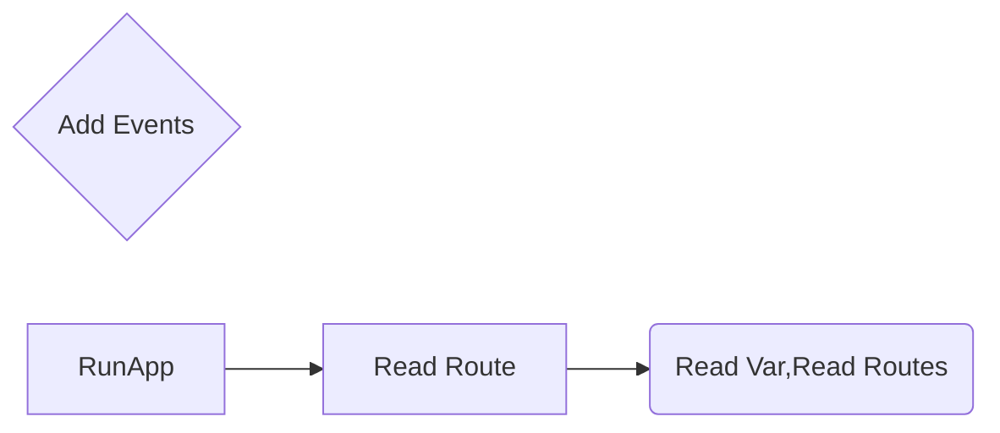

# Welcome to GoAssembly!

Hi! I'm your first Assembly app in **GoAssembly**.

# GoAssembly
Go Assembly is one Framework for WebAssembly 


## Hello Word Code

```go
package main

import (
	"github.com/AndrusGerman/GoAssembly"
)

func main() {
	//Se declaran las rutas
	GoAssembly.Ruta["index"] = RutaIndex()
	//Run app
	GoAssembly.RunApp()
}


func RutaIndex() *GoAssembly.Page {
	// App
	var App GoAssembly.Page
	//Template
	App.Template = `
	<center>
		<h1>Hello Word</h1>
	</center>
	`
	//Prepare code
	App.Prepare = func() {
		App.Title("Mi First App")
	}
	return &App
}
```
Guarda como `assembly/main.go`

## How to Compile

`$ GOARCH=wasm GOOS=js go build`

## How to Deploy
* Create Server
```go
package main

import "github.com/labstack/echo"

var server = ":8081"

func main() {
	s := echo.New()
	s.Static("/", "miapp")
	println("Server in http://localhost" + server)
	s.Start(":8081")
}
```
1) Save in `server.go`
2) Build server
3) Create `miapp` folder 
3) Copy `assembly` folder in `miapp`
### Writting....


## Run App Life





